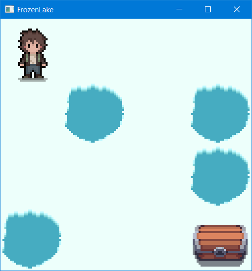

# Среда FrozenLake для СИМПР

## Структура проекта

1. `build` - файлы сборки
    1. `cmake` - (не работает полноценно, только в vscode c указанием переменной `cmake.buildDirectory` в файле `settings.json`)
    2. `vc22` - файлы проекта и решения для VisualStudio
2. `dep` - внешние зависимости
3. `dist` - директория, генерируемая скриптом `make_dist.bat`. Включает файлы поставки (исп.файл, библиотеки, ресурсы)
4. `include` - общие заголовочные файлы
5. `interpreter` - исходные файлы интерпретатора
6. `resources` - файлы ресурсов
7. `src` - общие исходные файлы

## Использование собранной программы

Запустить `SIMPRApp` из директории `dist`.

## Сборка и отладка

Сборка возможна только с использованием VisualStudio (2022).

Добавить в директорию `dep` папку с библиотекой CSFML.
Должна получиться следующая структура: `dep/CSFML/<bin, include, lib...>`.

Перед отладкой необходимо выполнить скрипт `prepare.ps1`, который создаст символьные ссылки на необходимые dll и файлы ресурсов.

Для удаления ссылок можно воспользоваться скриптом `cleanup.ps1`.